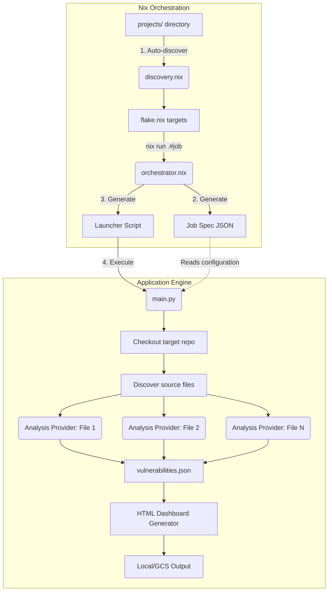

<!-- Licensed under the Apache-2.0 license -->
<!-- SPDX-License-Identifier: Apache-2.0 -->

# Mjolnir

Mjolnir is an AI-driven security auditing framework designed for open-source Root-of-Trust (RoT) projects.

It leverages AI foundation models and adversarial review pipelines to provide continuous security assurance through periodic, incremental scanning of firmware and RTL.

## Pipeline Architecture

Mjolnir separates the declarative configuration and environment definition (Nix) from the imperative analysis execution (Python application engine).



### Key Layers

- **Nix Layer (Orchestration)**:
  - **Discovery (`discovery.nix`)**: Scans the `projects/` directory to automatically register every project and job configuration as a Nix package target.
  - **Orchestration (`orchestrator.nix`)**: When a target is executed (via `nix run`), it packages the job by serializing the configuration attributes into a static JSON spec file in the Nix store, and builds a launcher script.
- **Python Layer (Application Engine)**:
  - **Orchestrator (`main.py`)**: Parses the serialized JSON spec, sets up the workspace directory, clones the target repository, and checks out the designated revision.
  - **Analysis Execution**: Filters files based on source directories and extensions, then delegates analysis to the specified provider backend (e.g., `genai` or `mock`).
  - **Reporting & Dashboarding**: Compiles the findings into `vulnerabilities.json` and generates an interactive HTML dashboard in the output directory.

### Execution Flow

1.  **Nix Auto-Discovery**: Nix dynamically generates packages from the `projects/` directory targets.
2.  **Target Launch**: Running `nix run .#<job-name>` executes the Nix-generated wrapper script.
3.  **JSON Spec Materialization**: The launcher script runs the application engine, passing a path to the serialized JSON job specification.
4.  **Checkout & Discovery**: Python clones/updates the target repository and identifies files matching the job's scope.
5.  **Scan Execution**: The chosen provider executes analysis on the source files and compiles the results.
6.  **Dashboard Generation**: The run's raw findings are compiled into reports and a local HTML dashboard.

## Directory Structure

- **[INTEGRATION_GUIDE.md](./INTEGRATION_GUIDE.md)**: Guide for integrating Mjolnir security audits into repositories (GitHub Actions, GCS export, PR diff mode).
- **[app/mjolnir/](./app/mjolnir/)**: Core Python application engine, including agent tools, data models, and providers (mock, genai). See [Application Engine README](./app/mjolnir/README.md).
- **[nix/](./nix/)**: Nix infrastructure for job packaging, auto-discovery, and orchestration. See [Nix README](./nix/README.md).
- **[projects/](./projects/)**: Supported project definitions and job configurations. See [Projects README](./projects/README.md).
- **`output/`**: Generated analysis reports, run logs, and HTML dashboards.

## Supported Projects

All project definitions, job configurations, and nix setups are located under [projects/](./projects/). See the [Projects README](./projects/README.md) for more details on how to register new targets, or read the [Integration Guide](./INTEGRATION_GUIDE.md) for step-by-step onboarding instructions.

## Getting Started

Mjolnir requires Nix with flakes enabled.

### Running an Audit

To run a predefined project audit runner target, execute `nix run`:

```bash
nix run .#<project-runner-target>
```

#### Examples

- **Run Caliptra SW Mock E2E Audit**:
  ```bash
  nix run .#caliptra-sw-runner-test
  ```
- **Run OpenTitan ROM Audit**:
  ```bash
  nix run .#opentitan-rom
  ```

---

## Compiling Dashboards

To aggregate the results of existing runs and regenerate the dashboard, you can use the `gen-dashboard` target:

```bash
nix run .#gen-dashboard
```

By default, this looks for runs in `./output/runs`. You can override the target directory using the `--` separator to pass arguments to the underlying application engine:

```bash
nix run .#gen-dashboard -- --output-dir /path/to/custom/runs
```

---

## Authentication

Mjolnir supports both Google Cloud Vertex AI and the Gemini Developer API.

### Gemini API Key (Gemini Developer API)

Set the API key in your environment:

```bash
export GEMINI_API_KEY="AIzaSy..."
```

### Vertex AI (Google Cloud Platform)

Set up Application Default Credentials (ADC) and project context:

```bash
export GOOGLE_APPLICATION_CREDENTIALS="/path/to/credentials.json"
export GOOGLE_CLOUD_PROJECT="your-gcp-project-id"
export GOOGLE_CLOUD_LOCATION="global"
```

---

## Testing

Mjolnir includes a suite of test targets to verify local pipelines, GCS uploads, and live LLM integration.

### Verification of Nix Infrastructure (Mocks)

To verify that the Nix derivations build cleanly:

```bash
nix build .#mock-smoke-test --no-link
```

To run a local mock test (verifies the python runner and local file system hooks):

```bash
nix run .#mock-smoke-test
```

To verify GCS storage uploads with mock data:

```bash
export MJOLNIR_GCS_BUCKET="your-bucket"
nix run .#mock-gcs-test
```

### Live LLM Testing

To verify your credentials or `GEMINI_API_KEY` against a real Gemini model (runs on a small subset of files using `gemini-3.6-flash`):

```bash
# Set credentials (either API key or GCP Vertex AI):
export GEMINI_API_KEY="AIzaSy..."

# Option A: GenAI Provider Target
nix run .#genai-gemini-test

# Option B: ADK Provider Target (Google Agent Development Kit)
nix run .#adk-gemini-test

# Option C: ADK Ingestion Mode
nix run .#adk-gemini-ingest-test
```

To verify end-to-end LLM scanning combined with GCS upload:

```bash
export MJOLNIR_GCS_BUCKET="your-bucket"
nix run .#genai-gemini-gcs-test
# or
nix run .#adk-gemini-gcs-test
```

### Running All Tests

To run all mock and live tests in a single command:

```bash
nix run .#test-all
```

To test the project runners (firmware compilation verification) locally:

```bash
nix run .#test-all-runners
```
